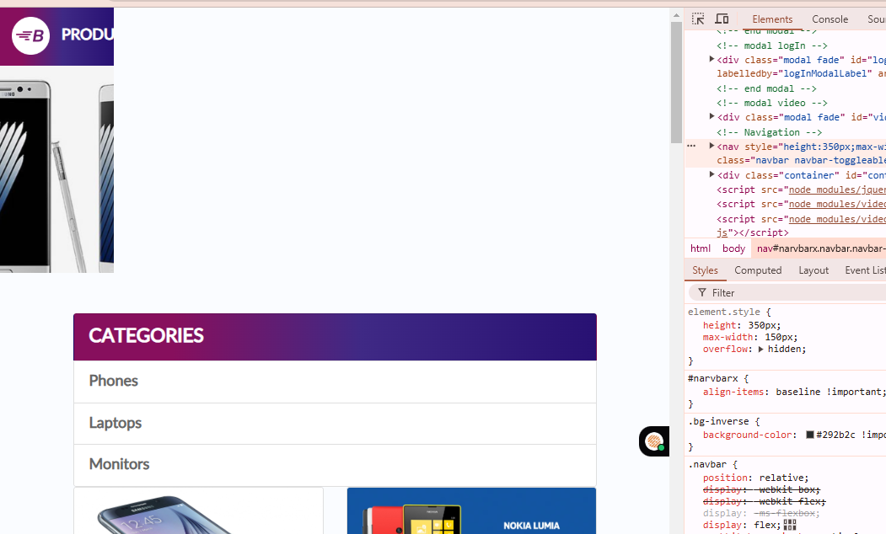

# 🧪 Chrome Browser Compatibility Report

**Tester:** Sheeza Raheem  
**Device Used:** iPhone 12 Pro, iPhone SE, Pixel 5, Desktop  
**Tool:** Chrome DevTools  
**Test Date:** July 2025  
**Site Tested:** https://www.demoblaze.com

---

## ✅ Devices & Observations (Chrome DevTools)

| Device     | Issue Found? | Summary                         | Status |
|------------|--------------|----------------------------------|--------|
| iPhone 12 Pro | ❌ No     | Responsive layout                | ✅ Pass |
| iPhone SE     | ✅ Yes    | Navbar text overlaps (simulated) | ❌ Fail |
| Pixel 5       | ❌ No     | Images and text scaled properly  | ✅ Pass |
| Desktop       | ❌ No     | Full layout and functionality    | ✅ Pass |

---

## 🛠️ Simulated Issue (on iPhone SE)

**CSS Added in DevTools:**

```css
max-width: 150px;
overflow: hidden;

**Screenshot:**



Recommendation:

Add responsive media queries

Allow flex-wrap in nav items
