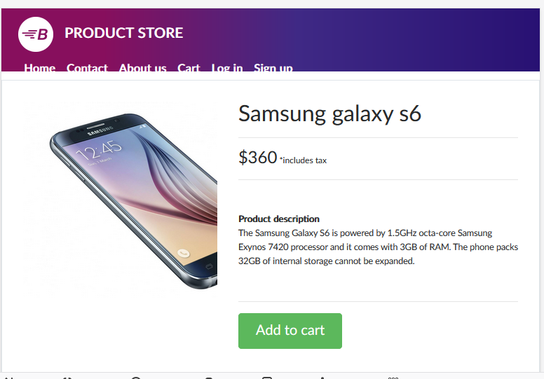

---

### 🔶 `firefox_report.md`

```markdown
# 🧪 Firefox Browser Compatibility Report

**Tester:** Sheeza Raheem  
**Device Used:** iPad Mini (Responsive Mode), Desktop  
**Tool:** Firefox Developer Tools  
**Test Date:** July 2025  
**Site Tested:** https://www.demoblaze.com

---

## ✅ Devices & Observations (Firefox Dev Tools)

| Device     | Issue Found? | Summary                           | Status |
|------------|--------------|------------------------------------|--------|
| iPad Mini   | ✅ Yes      | Product images slightly overlap     | ❌ Fail |
| Desktop     | ❌ No       | All elements rendered correctly     | ✅ Pass |

---

## 🛠️ Real Issue on iPad Mini

**Problem:**
- At 768px width, image cards in product grid overflow slightly

**Screenshot:**  



**Recommendation:**
- Add media query for 750–800px screen widths
- Use `flex-wrap: wrap` or `grid-template-columns` for product layout
